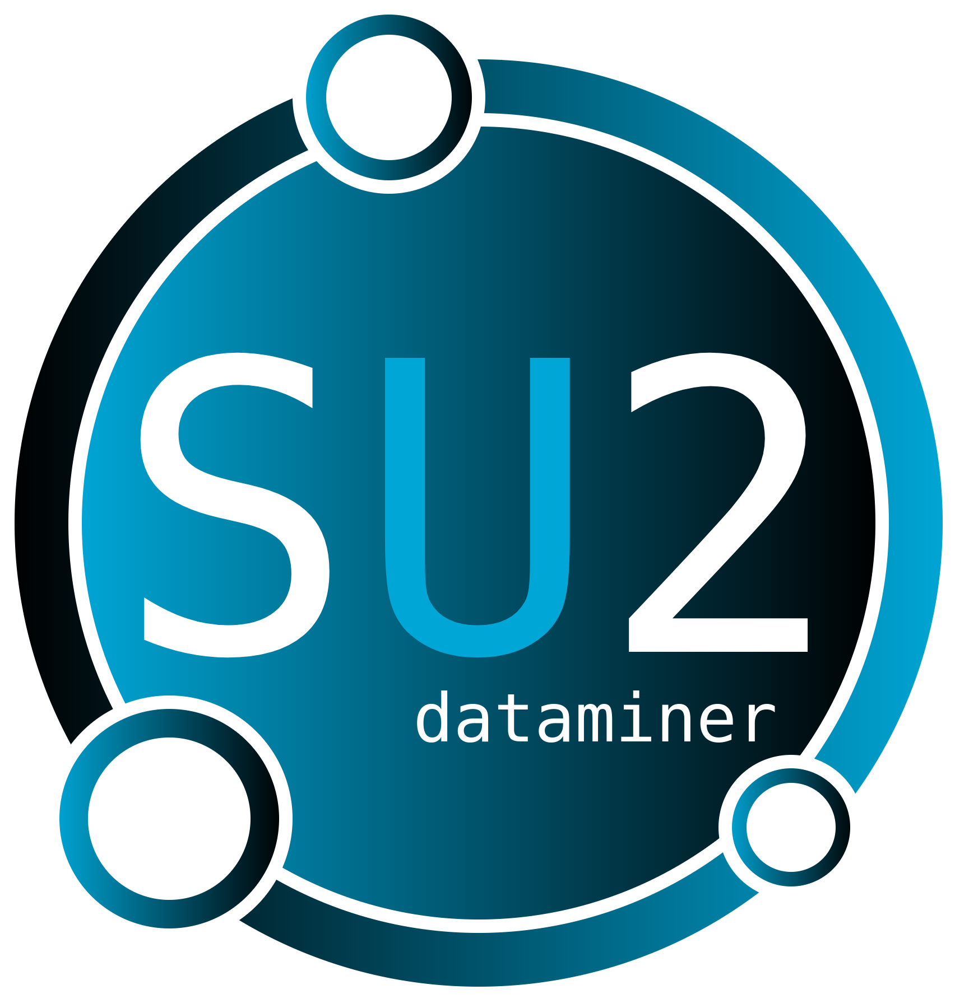

<p style="margin-bottom:1cm;"> </p>
<p align="center">
         
</p>
<p style="margin-bottom:1cm;"> </p
>


# SU2 DataMiner
This repository describes the workflow for manifold generation for data-driven fluid modeling in SU2. The workflow allows the user to generate fluid data and convert these into tables and train multi-layer perceptrons in order to retrieve thermo-chemical quantities during simulations in SU2. The applications are currently limited to non-ideal computational fluid dynamics and flamelet-generated manifold simulations for arbitrary fluids and reactants respectively. 

## Capabilities
The SU2 DataMiner workflow allows the user to generate fluid data and convert these into look-up tables (LUT) or multi-layer perceptrons (MLP) for usage in SU2 simulations. The types of simulations for which this workflow is suitable are flamelet-generated manifold (FGM) and non-ideal computational fluid dynamics (NICFD) simulations. This tool allows the user to start from scratch and end up with a table input file or a set of MLP input files which can immediately be used within SU2. 

## Requirements and Set-Up
The SU2 DataMiner tool is python-based and was generated with python 3.11. Currently only Linux distributions are supported.
You require the following modules for this workflow to run:
- numpy
- pickle
- os
- CoolProp
- cantera
- tqdm
- csv
- matplotlib
- random 
- tensorflow
- time 
- sklearn
- pyfiglet

After cloning this repository, add the following lines to your ```~/.bashrc``` in order to update your pythonpath accordingly:

```
export PINNTRAINING_HOME=<PATH_TO_SOURCE>
export PYTHONPATH=$PYTHONPATH:$PINNTRAINING_HOME
export PATH=$PATH:$PINNTRAINING_HOME/bin
```

where ```<PATH_TO_SOURCE>``` is the path to where you cloned the repository.

Tutorials can be found under ```TestCases```, proper documentation will follow soon.

## Getting Started

Generating a fluid data manifold for FGM or NICFD applications consists of the following steps:

1. *Generate a configuration*: The manifold settings such as the type of fluid, storage directory and range are stored in a configuration class. Configurations can be defined through python (example scripts are found in the TestCases folder, named ```generate_config.py```) or interactively through terminal inputs. In order to generate a configuration interactively, run the command ```GenerateConfig.py``` in the terminal.

2. *Generate fluid data*: Raw fluid data can be generated once the configuration is defined. Similarly to the configuration set-up, fluid data can be generated through a python interface enabling more flexibility, or through the terminal. Run the command ```GenerateFlameletData.py -h``` to see the available options. Optionally, flamelet data can be visualized through the ```PlotFlamelets.py``` command. 

3. *Process fluid data*: Raw fluid data needs to be processed in order to be converted into a manifold usable in SU2. Especially a flamelet-based manifold requires additional steps to convert raw flamelet data into a usable manifold. These steps include optimizing the progress variable, homogenizing the flamelet data, and grouping the various flamelet data into groups of high correlation. TODO: write executable for this step.

4. *Generate manifold*: The processed fluid data is ready for conversion into a manifold for SU2 simulations. The available formats are the look-up table (LUT) and multi-layer perceptron (MLP).

