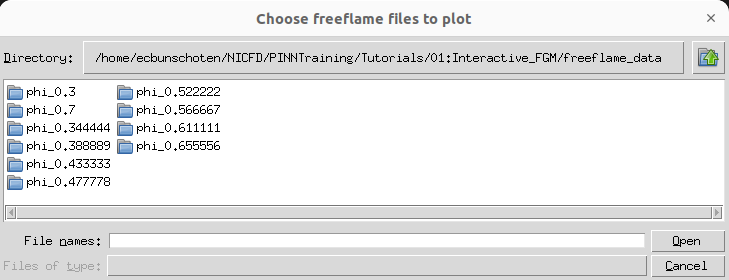
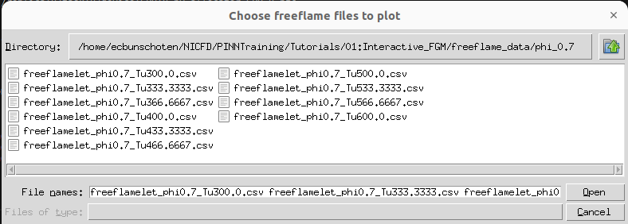
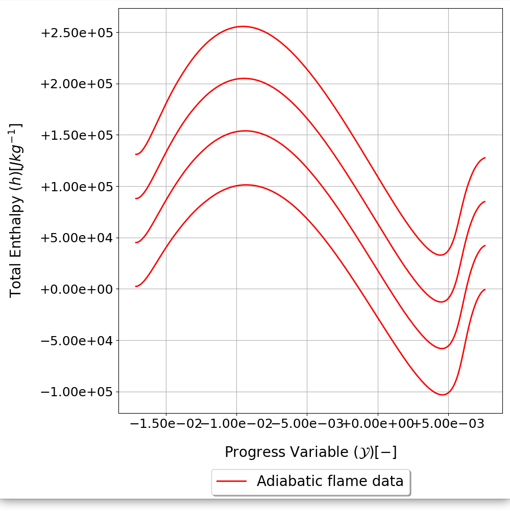
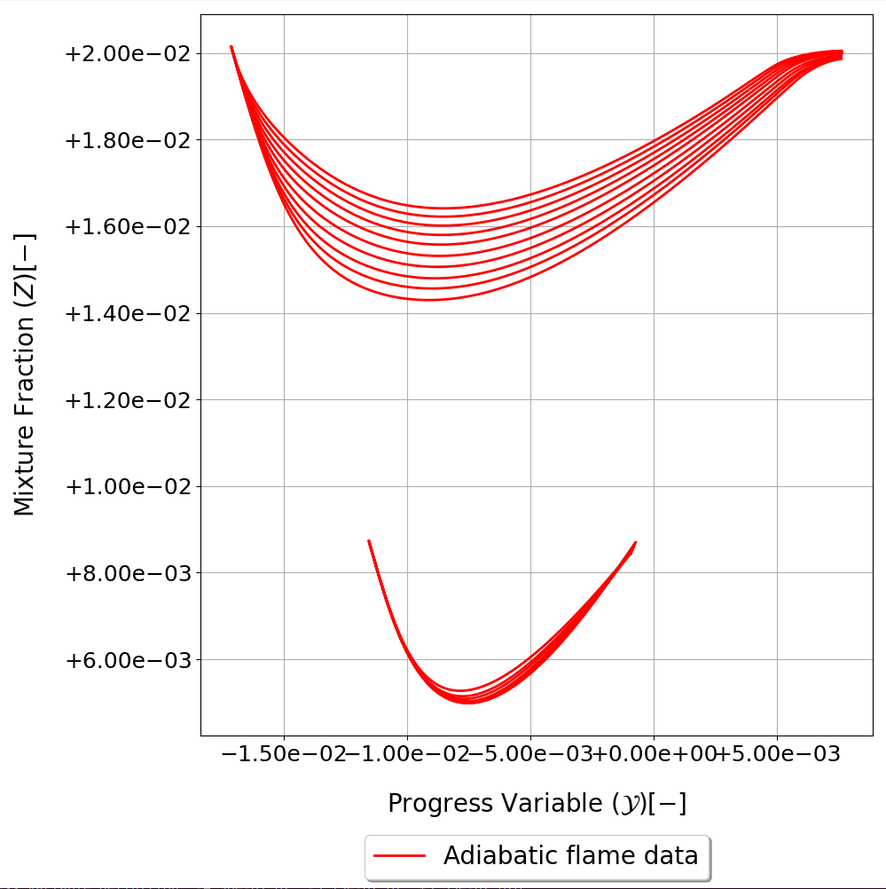
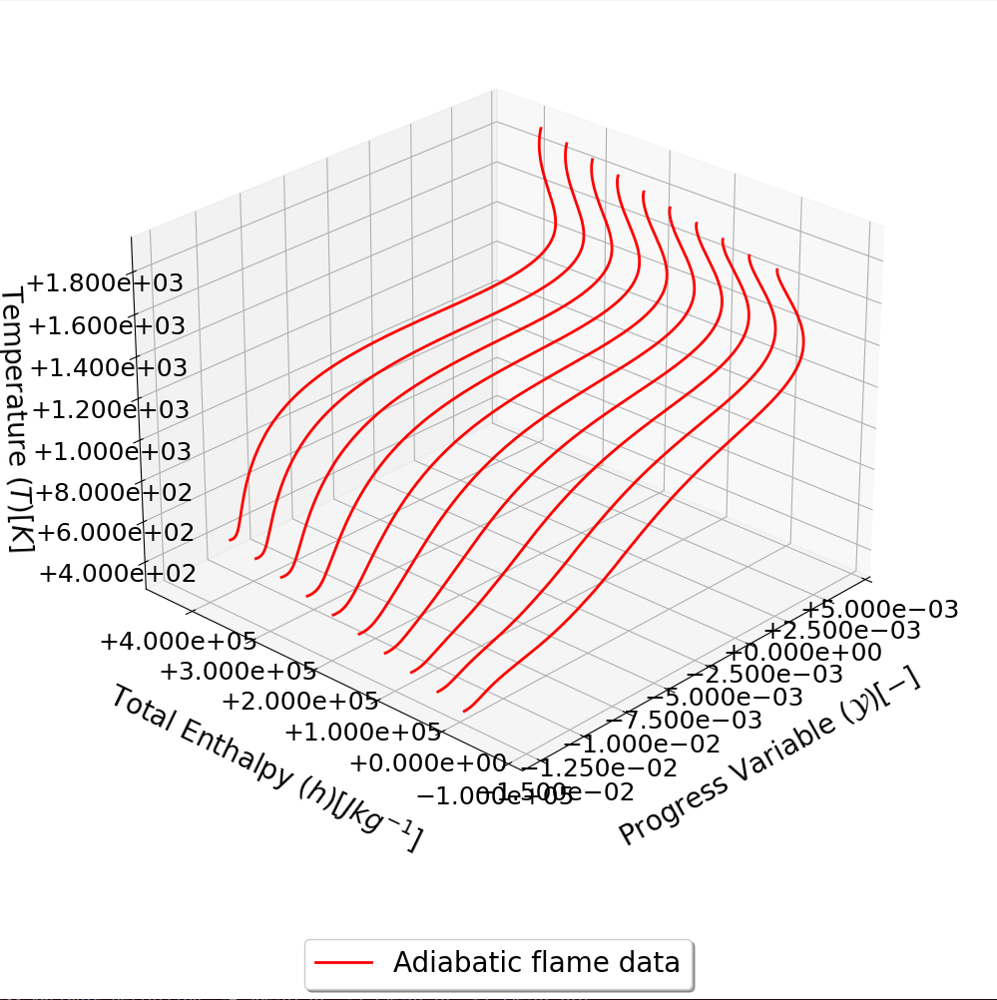

# SU2 DataMiner Tutorial 3: Flamelet data visualization 

| Parameter      | Description |
| ----------- | ----------- |
| Difficulty      | Easy      |
| Requires   | ```SU2 DataMiner```,```MPI```      |
| Uses | bin/PlotFlamelets.py|
| Author | E.C. Bunschoten |
| Version | 1.0.0 |

## Goals

The goal of this tutorial is to demonstrate the basic visualization of flamelet data through terminal commands.

## Set-up
Set up ```SU2 DataMiner``` as per the [general set-up instructions](../../README.md). Other than that, this tutorial requires no scripts or reference data. 

This tutorial uses the flamelet data generated in [tutorial 2](../02:Interactive_FlameletData/README.md), using the configuration defined in [tutorial 1](../01:Interactive_FGM/README.md), summarized as follows:

```
   _____ __  _____      ____        __        __  ____                
  / ___// / / /__ \    / __ \____ _/ /_____ _/  |/  (_)___  ___  _____
  \__ \/ / / /__/ /   / / / / __ `/ __/ __ `/ /|_/ / / __ \/ _ \/ ___/
 ___/ / /_/ // __/   / /_/ / /_/ / /_/ /_/ / /  / / / / / /  __/ /    
/____/\____//____/  /_____/\__,_/\__/\__,_/_/  /_/_/_/ /_/\___/_/     
                                                                      

flameletAIConfiguration: Tutorial_1

Flamelet generation settings:
Flamelet data output directory: Tutorials/01:Interactive_FGM
Reaction mechanism: h2o2.yaml
Transport model: mixture-averaged
Fuel definition: H2: 1.00e+00
Oxidizer definition: O2: 1.00e+00,N2: 3.76e+00

Reactant temperature range: 300.00 K -> 600.00 K (10 steps)
Mixture status defined as equivalence ratio
Reactant mixture status range: 3.00e-01 -> 7.00e-01  (10 steps)

Flamelet types included in manifold:
-Adiabatic free-flamelet data

Flamelet manifold data characteristics: 
Controlling variable names: ProgressVariable, EnthalpyTot, MixtureFraction
Progress variable definition: -4.96e-01 H2, -3.13e-02 O2, +5.55e-02 H2O

Average specie Lewis numbers:
H2:3.4532e-01, H:2.3124e-01, O:8.1336e-01, O2:1.2417e+00, OH:8.2708e-01, H2O:1.0149e+00, HO2:1.2245e+00, H2O2:1.2317e+00, AR:8.7322e-01, N2:7.6639e-01
```

## Tutorial

Visualizing flamelet data can be done through the ```PlotFlameletData.py``` command.  Running this command with no arguments displays the argument options.
```
usage: PlotFlamelets.py [-h] [--c CONFIG_NAME] [--m] [--x X_VAR] [--y Y_VAR] [--z Z_VAR]
                        [--Mix MIXTURE_STATUS [MIXTURE_STATUS ...]] [--save]

options:
  -h, --help            show this help message and exit
  --c CONFIG_NAME       FlameletAI configuration file name.
  --m                   Manually select flamelet data files to plot
  --x X_VAR             X-variable (default: ProgressVariable)
  --y Y_VAR             Y-variable (default: EnthalpyTot)
  --z Z_VAR             Z-variable
  --Mix MIXTURE_STATUS [MIXTURE_STATUS ...]
                        Mixture status values for which to plot flamelet data.
  --save                Save generated images in flamelet data folder.
```

The main options to set are ```--c```, ```--x```, ```--y```, and ```--z```. The option ```--c``` corresponds to the ```SU2 DataMiner``` configuration file name. In this tutorial, the configuration file from [tutorial 1](../01:Interactive_FGM/README.md) (Tutorial_1.cfg) will be used. The options ```--x```, ```--y```, and ```--z``` correspond to the flamelet data to plot along the x-, y-, and, optionally, z-axis. of the image. A 2D plot will be generated default, a 3D plot will be generated if a value is provided for ```--z```. By default, ```--x``` is set to the progress variable and ```--y``` is set to the total enthalpy.

The options ```--m``` and ```--Mix``` define the reactant mixture status values for which to plot flamelet data. The ```--m``` option allows the user to manually select flamelet data from a folder. The following command allows the user to manually select flamelet data and plots the progress variable and total enthalpy.

```
>>> PlotFlamelets.py --c ../01\:Interactive_FGM/Tutorial_1.cfg --m
```

Running this command opens a selection window



Here the user can navigate through folders to select flamelet data files to plot. For example, navigating into the folder ```phi_0.7``` shows the local flamelet data files.



The user can select one or multiple flamelet data files by selecting them and clicking the ```Open``` button. If no flamelet data files from this type are to be plotted, press the ```Cancel``` button. Below is a resulting plot from selecting the first four flamelet data files in the folder ```phi_0.7```.



On the other hand, providing additional arguments to ```--Mix``` reads the flamelet data from the corresponding mixture status values and plots all flamelets in the same image. 
For example, the following command plots the progress variable and mixture fraction for the flamelet data generated at an equivalence ratio of 0.3 and 0.7.

```
>>> PlotFlamelets.py --c ../01\:Interactive_FGM/Tutorial_1.cfg --y MixtureFraction --Mix 0.3 0.7
```



In order to generate 3D plots, an input should be provided for the ```--z``` argument. For example, the following command plots the progress variable, total enthalpy, and temperature of the flamelet data generated at an equivalence ratio of 0.522.

```
>>> PlotFlamelets.py --c ../01\:Interactive_FGM/Tutorial_1.cfg --z Temperature --Mix 0.522222
```



It is also possible to save the image automatically when it is rendered. For this, use the ```--save``` option. 


